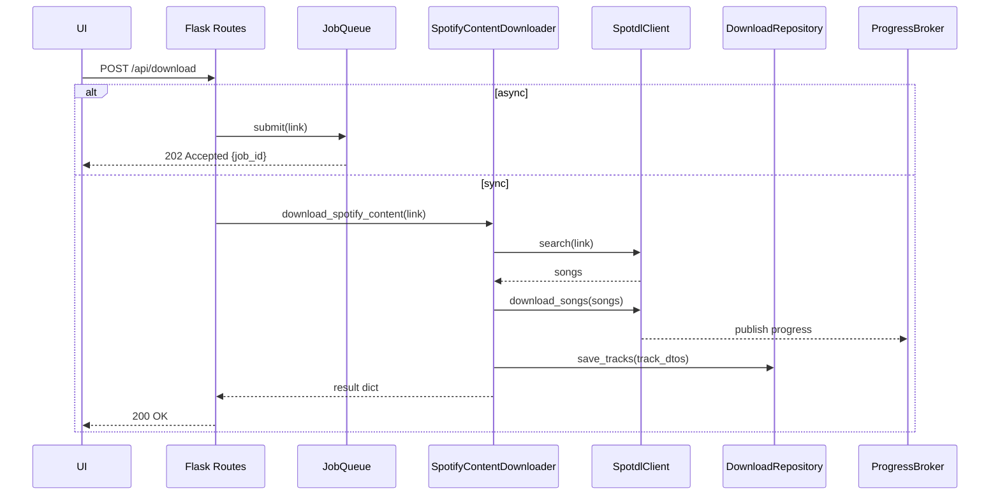
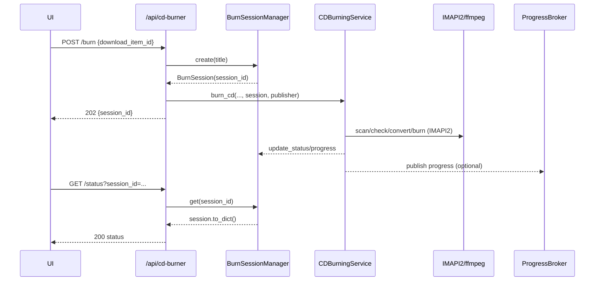

CD�?`Collector Architecture

This document summarizes the current backend architecture, focusing on the new per�?`session CD burning model, dependency injection boundaries, and request flows with sequence diagrams.

Goals

- Decouple business logic from Flask runtime objects for testability
- Replace global mutable state with per�?`session tracking
- Provide clear boundaries for persistence, progress publishing, and external processes

High�?`Level Components

- API server: Flask app (`app.py`) exposing blueprints under `src/routes/*`
- Orchestrator: `src/spotify_content_downloader.py` coordinates metadata, SpotDL, file and DB writes
- SpotDL Client: `src/spotdl_client.py` �?" thread�?`bound engine wrapper with gated output suppression
- Persistence: SQLAlchemy models + initializer in `src/database/db_manager.py`; repository interface in `src/repository.py`
- Progress: In�?`memory SSE broker and adapters in `src/progress.py`
- Jobs: Lightweight in�?`process queue in `src/jobs.py`
- CD Burning: Service in `src/cd_burning_service.py` with per�?`session status in `src/burn_sessions.py`

Dependency Injection (DI) Points

Injected in `app.py:create_app()` and passed to consumers:

- `ProgressPublisher` �+' built as `BrokerPublisher(ProgressBroker())`
- `SpotdlClient` �+' single instance (if credentials available)
- `DownloadRepository` �+' default is SQLAlchemy�?`backed (`DefaultDownloadRepository`)
- `BurnSessionManager` �+' app�?`scoped session registry for CD burns

These are provided to:

- `SpotifyContentDownloader(progress_publisher, spotdl_client, download_repository)`
- `CDBurningService` is app�?`scoped; per�?`request it receives a `BurnSession` and optional `ProgressPublisher`

Per�?`Session Burn Model

- `BurnSession` (thread�?`safe) holds status for one burn: fields include `is_burning`, `current_status`, `progress_percentage`, `last_error`, and disc detection flags.
- `BurnSessionManager` creates/returns sessions and tracks the most recent; enforces a simple single�?`device concurrency policy via `is_any_burning()`.
- Routes:
  - `POST /api/cd-burner/burn` �+' creates a session and starts work in a thread; returns `{ session_id }`.
  - `GET /api/cd-burner/status?session_id=...` �+' returns `BurnSession.to_dict()`; if no `session_id`, returns last session when available.
- Service: `CDBurningService` methods accept `session: BurnSession` and optional `publisher: ProgressPublisher` to report updates without global singletons.

Sequence Diagrams

Download flow (simplified):

CD burn flow (per�?`session):

Persistence Boundary

- Repository interface `DownloadRepository` abstracts persistence of `TrackDTO` lists.
- Default implementation uses SQLAlchemy models in `src/database/db_manager.py`.
- Orchestrator calls `repo.save_tracks(track_dtos)`; alternative repositories (e.g., mocked in tests) can be injected.

Progress Publishing

- `ProgressPublisher` abstracts event publishing; `BrokerPublisher` adapts the in�?`memory `ProgressBroker` used by SSE (`/api/progress/stream`).
- Orchestrator and CD burning service publish structured dicts; frontends can filter by event type or session id.

Configuration

- Core: `config.Config` (env�?`backed)
- App settings: `src/settings.py` (pydantic) builds SpotDL options and runtime flags
- Notable flags:
  - `SPOTDL_SUPPRESS_OUTPUT` (default true): silence SpotDL/subprocess output (gated and serialized with a semaphore)

Testing Notes

- Orchestrator no longer requires `current_app`; tests can inject fakes for `progress_publisher`, `spotdl_client`, and repository, or rely on the broker fallback if running in an app context.
- CD burning is session�?`scoped and side�?`effectful; tests should stub subprocess calls and use ephemeral `BurnSession` instances.

Future Improvements

- Replace in�?`process `JobQueue` with a durable queue if needed
- Introduce `Storage` abstraction for filesystem operations
- Split DB models into a dedicated module (separate from initializer)

